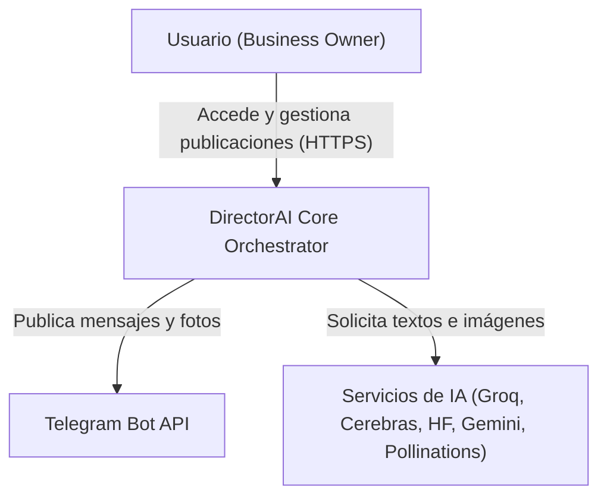
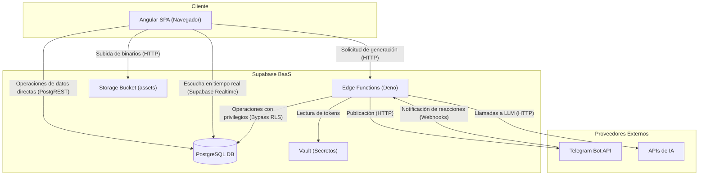
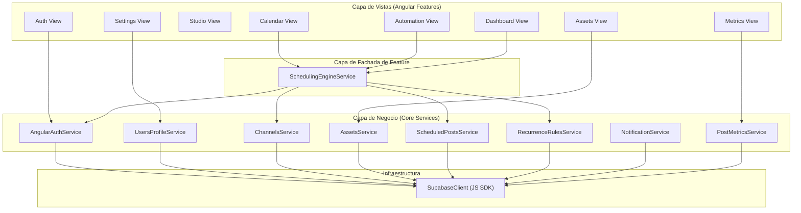
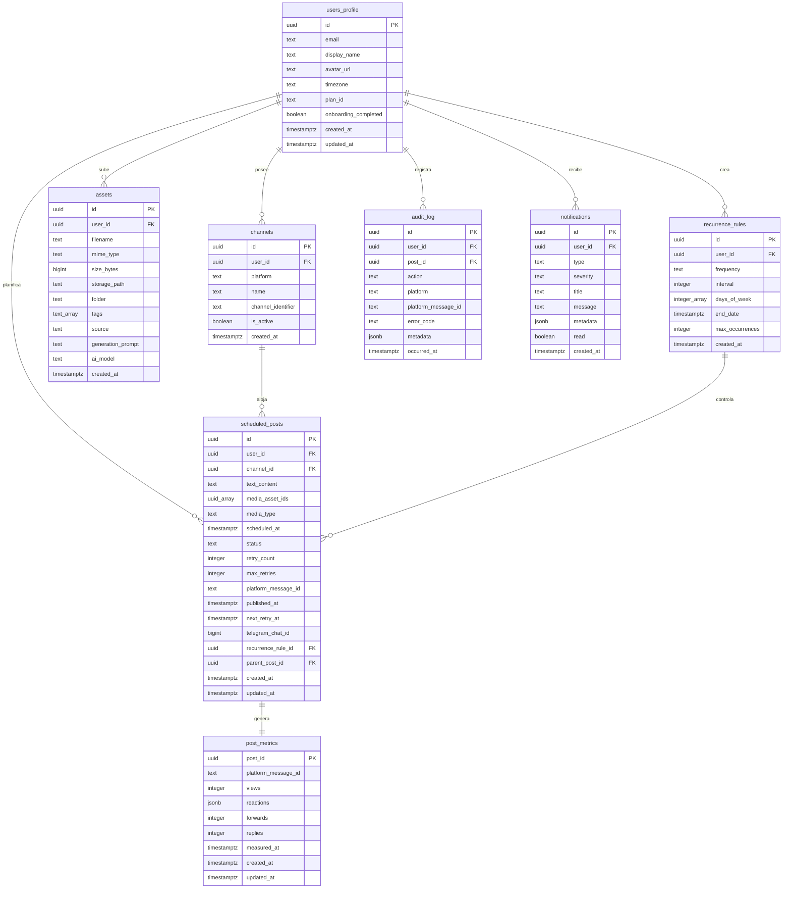
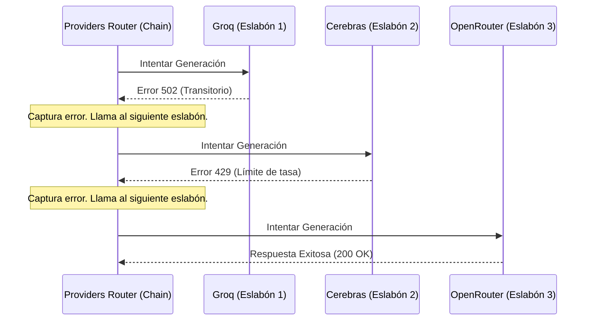

# Manual Técnico de DirectorAI

## Contenido
1. [Introducción](#1-introducción)
2. [Arquitectura](#2-arquitectura)
3. [Integración](#3-integración)
4. [Base de Datos](#4-base-de-datos)
5. [Patrones de Diseño](#5-patrones-de-diseño)
6. [Frontend](#6-frontend)
7. [Enmascaramiento de API](#7-enmascaramiento-de-api)
8. [Funciones del Servidor](#8-funciones-del-servidor)
9. [Despliegue](#9-despliegue)

---

## 1. Introducción

### Propósito
Este manual proporciona una especificación técnica de la arquitectura de la plataforma **DirectorAI**. Está dirigido a desarrolladores, administradores de sistemas y agentes de codificación encargados de dar soporte y extensión al núcleo del software.

### Descripción
**DirectorAI** es un sistema SaaS diseñado para automatizar los flujos de creación, planificación y publicación de publicaciones en canales de Telegram. Proporciona una suite web integrada con generación de textos e imágenes asistida por múltiples modelos de inteligencia artificial, un calendario interactivo y un motor de base de datos que despacha tareas programadas de forma resiliente en lotes.

### Stack Tecnológico
El software se divide en dos entornos de ejecución:

*   **Frontend (Angular SPA):**
    *   **Versión del Core:** Angular v21.2.0.
    *   **Gestión del Estado:** Angular Signals y RxJS.
    *   **Diseño:** Tailwind CSS v4.3.1 (PostCSS) y SCSS.
    *   **Componentes:** `@spartan-ng/brain` (Headless) y `@spartan-ng/helm` (estilizado).
    *   **SDK Base de Datos:** `@supabase/supabase-js` v2.108.2.
*   **Backend (Supabase BaaS):**
    *   **Base de Datos:** PostgreSQL con extensiones `pg_cron`, `pg_net` y `pgcrypto`.
    *   **Funciones:** Supabase Edge Functions ejecutadas en Deno Runtime (TypeScript).
    *   **Vault:** Supabase Vault para claves simétricas de cifrado de secretos.
*   **Servicios Externos de Modelos (IA):**
    *   **Texto:** Groq (Llama 3.3), Cerebras (Llama 3.1), OpenRouter (Gemma 4) y Gemini (Gemini 2.5).
    *   **Imagen:** Pollinations AI, Hugging Face (Flux.1) y Gemini (Gemini 3.1).
*   **Destino de Publicación:**
    *   **Red Social:** Telegram Bot API.

---

### Estructura Modular
El proyecto está estructurado de manera que tanto el frontend como el backend se alinean con los 6 módulos funcionales descritos en la sección de arquitectura.

```text
DirectorAI/
├── supabase/
│   ├── migrations/                   # Base de Datos (Backend)
│   │   ├── 001_create_users_profile.sql       --> Módulo 1: Gestión de Usuarios
│   │   ├── 002_create_channels.sql            --> Módulo 4: Planificación y Automatización
│   │   ├── 003_create_assets.sql              --> Módulo 2: Gestión de Contenido Multimedia
│   │   ├── 004_create_recurrence_rules.sql    --> Módulo 4: Planificación y Automatización
│   │   ├── 005_create_scheduled_posts.sql     --> Módulo 4: Planificación y Automatización
│   │   ├── 006_create_audit_log.sql           --> Módulo 6: Analítica y Notificaciones
│   │   ├── 008_create_notifications.sql       --> Módulo 6: Analítica y Notificaciones
│   │   ├── 011b_storage_policies.sql          --> Módulo 5: Edición y Almacenamiento
│   │   ├── 012_audit_log_immutability.sql     --> Módulo 6: Analítica y Notificaciones
│   │   ├── 013_vault_rpc.sql                  --> Módulo 1: Gestión de Usuarios
│   │   └── 014_create_post_metrics.sql        --> Módulo 6: Analítica y Notificaciones
│   └── functions/                    # Edge Functions (Backend)
│       ├── _shared/                  # Servicios Compartidos del Núcleo
│       │   ├── auth.service.ts                --> Módulo 1: Gestión de Usuarios
│       │   ├── asset-storage.service.ts       --> Módulo 2: Gestión de Contenido Multimedia
│       │   ├── gen-ai.service.ts              --> Módulo 3: Asistente de IA
│       │   ├── providers.ts                   --> Módulo 3: Asistente de IA
│       │   ├── retry-engine.ts                --> Módulo 4: Planificación y Automatización
│       │   ├── alert.service.ts               --> Módulo 6: Analítica y Notificaciones
│       │   └── metrics.service.ts             --> Módulo 6: Analítica y Notificaciones
│       ├── gen-ai-studio/            # Generación IA (Módulo 3)
│       ├── scheduler/                # Motor de Envíos (Módulo 4)
│       ├── metrics-poller/           # Ingesta de Datos (Módulo 6)
│       └── telegram-webhook/         # Captura de Reacciones (Módulo 6)
└── frontend/                         # Aplicación Web (Frontend)
    ├── src/
    │   ├── app/
    │   │   ├── core/
    │   │   │   └── services/         # Servicios Centrales
    │   │   │       ├── auth.service.ts        --> Módulo 1: Gestión de Usuarios
    │   │   │       ├── users-profile.service.ts--> Módulo 1: Gestión de Usuarios
    │   │   │       ├── assets.service.ts      --> Módulo 2: Gestión de Contenido Multimedia
    │   │   │       ├── gen-ai.service.ts      --> Módulo 3: Asistente de IA
    │   │   │       ├── scheduled-posts.service.ts--> Módulo 4: Planificación y Automatización
    │   │   │       ├── recurrence-rules.service.ts--> Módulo 4: Planificación y Automatización
    │   │   │       ├── notifications.service.ts--> Módulo 6: Analítica y Notificaciones
    │   │   │       └── post-metrics.service.ts --> Módulo 6: Analítica y Notificaciones
    │   │   └── features/             # Capa de Interfaz
    │   │       ├── auth/             # Pantallas (Módulo 1: Gestión de Usuarios)
    │   │       ├── studio/           # Pantallas (Módulo 3: Asistente de IA)
    │   │       ├── assets/           # Pantallas (Módulo 2: Gestión de Contenido Multimedia)
    │   │       ├── calendar/         # Pantallas (Módulo 4: Planificación y Automatización)
    │   │       ├── automation/       # Pantallas (Módulo 4: Planificación y Automatización)
    │   │       ├── metrics/          # Pantallas (Módulo 6: Analítica y Notificaciones)
    │   │       └── settings/         # Pantallas (Módulo 1: Gestión de Usuarios)
    │   └── styles/                   # Sistema de Estilos SCSS
```

---

### Estructura de Desglose de Trabajo
Desglose jerárquico del sistema limitado a cuatro niveles de profundidad (Nivel 0 al Nivel 3):

*   **Nivel 0: Sistema DirectorAI**
    *   **Nivel 1: 1.0 Módulo de Gestión de Usuarios**
        *   **Nivel 2: 1.1 Vistas y Componentes de Identidad**
            *   **Nivel 3: 1.1.1 Vistas de Autenticación (`features/auth/`)**
            *   **Nivel 3: 1.1.2 Panel de Ajustes (`features/settings/`)**
        *   **Nivel 2: 1.2 Servicios de Autenticación y Perfil**
            *   **Nivel 3: 1.2.1 Servicio `AngularAuthService`**
            *   **Nivel 3: 1.2.2 Servicio `UsersProfileService`**
        *   **Nivel 2: 1.3 Seguridad del Core Backend**
            *   **Nivel 3: 1.3.1 Reglas RLS de Usuarios**
    *   **Nivel 1: 2.0 Módulo de Gestión de Contenido Multimedia**
        *   **Nivel 2: 2.1 UI de Catálogo y Assets**
            *   **Nivel 3: 2.1.1 Vista de Repositorio (`features/assets/`)**
        *   **Nivel 2: 2.2 Servicio de Metadatos de Medios**
            *   **Nivel 3: 2.2.1 Servicio `AssetsService`**
        *   **Nivel 2: 2.3 Estructura de Datos de Assets**
            *   **Nivel 3: 2.3.1 Tabla `assets` en Base de Datos**
    *   **Nivel 1: 3.0 Módulo de Asistente de IA**
        *   **Nivel 2: 3.1 Editor AI Studio**
            *   **Nivel 3: 3.1.1 Vista de AI Studio (`features/studio/`)**
            *   **Nivel 3: 3.1.2 Módulo de Brainstorm**
        *   **Nivel 2: 3.2 Gateway y Ruteo AI**
            *   **Nivel 3: 3.2.1 Edge Function `gen-ai-studio`**
            *   **Nivel 3: 3.2.2 Router de Proveedores (`providers.ts`)**
        *   **Nivel 2: 3.3 Integración de Modelos e Interfaces**
            *   **Nivel 3: 3.3.1 API de Texto**
            *   **Nivel 3: 3.3.2 API de Imagen**
    *   **Nivel 1: 4.0 Módulo de Planificación y Automatización**
        *   **Nivel 2: 4.1 Planificador Editorial**
            *   **Nivel 3: 4.1.1 Vista de Calendario (`features/calendar/`)**
            *   **Nivel 3: 4.1.2 Vista de Automatización (`features/automation/`)**
        *   **Nivel 2: 4.2 Facade de Planificación**
            *   **Nivel 3: 4.2.1 Servicio `SchedulingEngineService`**
        *   **Nivel 2: 4.3 Motor de Publicación del Servidor**
            *   **Nivel 3: 4.3.1 Edge Function `scheduler`**
            *   **Nivel 3: 4.3.2 Motor de Reintentos (`_shared/retry-engine.ts`)**
    *   **Nivel 1: 5.0 Módulo de Edición y Almacenamiento**
        *   **Nivel 2: 5.1 Almacenamiento Físico**
            *   **Nivel 3: 5.1.1 Supabase Storage Bucket `assets`**
        *   **Nivel 2: 5.2 Capa de Upload e Integración**
            *   **Nivel 3: 5.2.1 Servicio `AssetUploadService`**
    *   **Nivel 1: 6.0 Módulo de Analítica y Notificaciones**
        *   **Nivel 2: 6.1 UI de Analítica e Historial**
            *   **Nivel 3: 6.1.1 Panel de Métricas (`features/metrics/`)**
            *   **Nivel 3: 6.1.2 Campana de Notificaciones (Header)**
        *   **Nivel 2: 6.2 Recolectores de Métricas y Webhooks**
            *   **Nivel 3: 6.2.1 Edge Function `metrics-poller`**
            *   **Nivel 3: 6.2.2 Edge Function `telegram-webhook`**
        *   **Nivel 2: 6.3 Base de Datos de Ingesta**
            *   **Nivel 3: 6.3.1 Triggers de Seguridad**

---

## 2. Arquitectura

### Diagrama de Contexto
El siguiente diagrama detalla la interacción del sistema con los usuarios finales y los agentes externos (proveedores de red social y LLMs de IA):



### Diagrama de Contenedores
Describe los límites de los entornos lógicos del proyecto:



### Diagrama de Componentes
Organización de los módulos internos del frontend Angular:



---

## 3. Integración

### Servicios Externos
DirectorAI integra y consume de forma directa las siguientes APIs externas:

1.  **Telegram Bot API:** Consumida mediante endpoints HTTP POST (`sendMessage`, `sendPhoto`, `sendVideo`, `sendAudio` y `sendDocument`) para despachar el contenido multimedia.
2.  **Groq API:** Utilizado para la generación rápida de textos mediante el modelo `llama-3.3-70b-versatile`.
3.  **Cerebras API:** Alternativa ultra-rápida de generación de textos usando el modelo `llama3.1-8b`.
4.  **OpenRouter API:** Utilizado como fallback secundario mediante el modelo `google/gemma-4-31b-it:free`.
5.  **Gemini API:** Generación nativa de textos (`gemini-2.5-flash`) e imágenes (`gemini-3.1-flash-lite-image`).
6.  **Pollinations AI:** Generación rápida de imágenes consumida mediante peticiones HTTP GET y retornado en formato binario Buffer.
7.  **Hugging Face Inference API:** Generación de imágenes premium de alta calidad mediante `black-forest-labs/FLUX.1-schnell`.

---

## 4. Base de Datos

### Modelo de Datos
La estructura lógica del motor PostgreSQL cuenta con las siguientes tablas:



### Diccionario de Datos

*   **`users_profile`:** Perfiles extendidos asociados 1:1 con la tabla `auth.users`.
    *   `id` (`UUID PK`): Identificador del usuario.
    *   `email`, `display_name`, `avatar_url`, `timezone`, `plan_id` (`starter`, `professional`, `agency`), `onboarding_completed`.
*   **`channels`:** Canales de destino para publicaciones.
    *   `id` (`UUID PK`), `user_id` (`UUID FK`), `platform` (ej: `'telegram'`), `name`, `channel_identifier`, `is_active` (`DEFAULT true`).
*   **`assets`:** Metadatos de ficheros cargados o generados.
    *   `id` (`UUID PK`), `user_id` (`UUID FK`), `filename`, `mime_type`, `size_bytes`, `storage_path`, `folder` (`DEFAULT '/'`), `tags` (`text[]`), `source` (`user_upload`, `ai_generated`), `generation_prompt`, `ai_model`.
*   **`recurrence_rules`:** Parámetros de repeticiones periódicas.
    *   `id` (`UUID PK`), `user_id` (`UUID FK`), `frequency` (`daily`, `weekly`, `monthly`), `interval`, `days_of_week` (`int[]`), `end_date`, `max_occurrences`.
*   **`scheduled_posts`:** Tareas programadas del publicador.
    *   `id` (`UUID PK`), `user_id` (`UUID FK`), `channel_id` (`UUID FK`), `text_content`, `media_asset_ids` (`uuid[]`), `media_type` (`photo`, `video`, `audio`, `document`), `scheduled_at`, `status` (`draft`, `scheduled`, `publishing`, `published`, `retrying`, `failed`, `cancelled`), `retry_count`, `max_retries`, `platform_message_id`, `published_at`, `next_retry_at`, `telegram_chat_id`, `recurrence_rule_id` (`UUID FK`), `parent_post_id` (`UUID FK`).
*   **`audit_log`:** Registro de acciones críticas e inmutables del sistema.
    *   `id` (`UUID PK`), `user_id` (`UUID FK`), `post_id` (`UUID FK`), `action` (`published`, `failed`, `retried`, `cancelled`, `edited`, `deleted`, `created`, `publishing`), `platform`, `platform_message_id`, `error_code`, `metadata` (`jsonb`), `occurred_at`.
*   **`notifications`:** Alertas y mensajes al usuario.
    *   `id` (`UUID PK`), `user_id` (`UUID FK`), `type`, `severity` (`info`, `warning`, `error`, `success`), `title`, `message`, `metadata` (`jsonb`), `read` (`DEFAULT false`).
*   **`post_metrics`:** Métricas históricas capturadas por posts publicados en Telegram.
    *   `post_id` (`UUID PK`), `platform_message_id`, `views`, `reactions` (`jsonb`), `forwards`, `replies`.

### Autenticación
Soportada de forma nativa por **Supabase Auth**. Utiliza flujos JWT de corta duración inyectados automáticamente en cada llamada HTTP de la API REST o llamadas a Edge Functions.

### Seguridad
Asegurada mediante **Row Level Security (RLS)** de PostgreSQL:
*   Políticas RLS en tablas transaccionales restringen la lectura y escritura mediante la condición `user_id = auth.uid()`.
*   La tabla `audit_log` restringe el acceso de escritura únicamente al rol interno del sistema `service_role`. Las políticas RLS deniegan el `UPDATE` y `DELETE` para cualquier actor (`USING (false)`).
*   Storage policies exigen que la ruta raíz del archivo en el bucket coincida exactamente con el UUID del usuario.

### Triggers
*   `set_updated_at()`: Actualiza la columna `updated_at = now()` en eventos de modificación de fila de `users_profile` y `scheduled_posts`.
*   `enforce_audit_log_occurred_at()`: Fuerza que la columna `occurred_at` siempre sea `now()` en inserciones de auditoría.
*   `block_audit_log_mutations()`: Emite una excepción si se intenta ejecutar un comando de actualización o borrado en la tabla `audit_log`.

### Almacenamiento
Consolidado en el bucket privado `assets` de **Supabase Storage**. Los binarios cargados o generados se aíslan físicamente en carpetas y se consumen en la SPA de Angular solicitando URLs firmadas con validez temporal en segundos (`createSignedUrl`).

---

## 5. Patrones de Diseño

El sistema DirectorAI implementa los siguientes patrones de diseño de software para estructurar su código:

### Cadena de Responsabilidad
Implementado en `providers.ts` para la orquestación y ruteo de generación de contenidos por IA. El motor itera secuencialmente a través de un listado prioritario de proveedores de IA. Ante errores transitorios (HTTP 429, 502, timeouts), captura el fallo de forma transparente y delega la ejecución al siguiente eslabón configurado.



### Estrategia
La interfaz `SocialMediaPublisher` y sus implementaciones (como `TelegramPublisher`) representan una familia de algoritmos intercambiables para publicar en diferentes redes. El motor obtiene dinámicamente la estrategia de publicación adecuada desde un registro según el canal seleccionado.

### Método Plantilla
Implementado en `BasePublisher` (en `social-media-publisher.interface.ts`). El método público principal `publish(...)` encapsula el flujo de control común (comprobación de doble envío e inicio de validaciones generales) y delega la implementación específica de la plataforma a un método abstracto protegido (`doPublish(...)`).

### Registro
La clase `PublisherRegistry` centraliza y gestiona las instancias de los diferentes publicadores lógicos. Expone métodos sencillos (`register(...)`, `get(...)`, `has(...)`) que encapsulan la inicialización en memoria de las estrategias de publicación disponibles.

### Fachada
*   **En Core:** Los servicios del frontend Angular (como `AssetsService` y `ScheduledPostsService`) actúan como fachadas lógicas que ocultan el uso del cliente global `SupabaseClient` a los componentes visuales de la interfaz de usuario.
*   **En Features:** `SchedulingEngineService` unifica múltiples servicios del core y llamadas a bases de datos relacionales en una API simplificada que emula la API del motor de backend.

### Observador
Implementado mediante RxJS en el frontend:
*   `authState$` BehaviorSubject notifica de forma reactiva los cambios de sesión de Supabase Auth a todos los módulos y componentes registrados.
*   `NotificationService` abre canales WebSockets (`supabase.channel(...)`) y retransmite eventos en tiempo real a Signals.

### Mapeador de Datos
Implementado en las funciones `mapRow` de cada servicio del core de Angular. Adapta los registros de datos planos relacionales en formato snake_case a modelos de objetos lógicos estructurados en formato camelCase consumibles por la UI.

### Inyección de Dependencias
Implementado a través del contenedor nativo de Angular mediante directivas `@Injectable({ providedIn: 'root' })` y el uso del token `inject(SupabaseClient)`. Garantiza instancias únicas (Singleton) de los servicios y desacopla la inicialización de los componentes.

---

## 6. Frontend

### Estructura del Proyecto
El frontend se organiza de la siguiente manera para mantener el desacoplamiento:
*   `src/app/core/services/`: Servicios singleton globales encargados de la llamada a bases de datos y Deno Edge Functions.
*   `src/app/core/guards/`: Controladores de acceso a rutas (`AuthGuard`, `FeatureGateGuard`).
*   `src/app/features/`: Componentes standalone que contienen la maquetación visual y la captura de inputs del usuario.
*   `src/app/styles/`: Hojas de estilo y tokens lógicos globales.

### Rutas
Definidas en `app.routes.ts`. La subruta principal `/app` está protegida por `AuthGuard`. Las subrutas específicas como `/studio` y `/metrics` integran adicionalmente el `FeatureGateGuard` para restringir el acceso a herramientas según las cuotas mensuales cargadas.

### Gestión del Estado
Mantenida mediante **Angular Signals** para reactividad interna y sincronización de variables rápidas (como la campana de notificaciones, perfiles y estados de carga). Adicionalmente, utiliza **RxJS Observables** para flujos continuos asíncronos y eventos en tiempo real de la base de datos de Supabase.

### Sistema de Estilo
*   **SCSS y Tokens:** Los tokens globales de colores, tipografías y espaciados se declaran en `styles/tokens.scss` y se importan al compilador.
*   **Tailwind CSS v4:** El archivo `styles.scss` inicializa Tailwind y utiliza la directiva `@theme` para vincular sus clases de diseño a las propiedades del archivo de tokens de SCSS.
*   **Spartan-NG (Brain vs Helm):** Los componentes de interfaz interactivos utilizan Spartan. `@spartan-ng/brain` se encarga de la accesibilidad semántica y estados de foco, mientras que `@spartan-ng/helm` aplica directamente las clases de utilidad de Tailwind CSS.

---

## 7. Enmascaramiento de API

### Detalle de Servicios
Los servicios del frontend enmascaran el cliente SDK de Supabase:

1.  **`AngularAuthService`:** Envuelve `this.supabase.auth` expidiendo firmas para `signUp`, `signIn`, `signOut`, `resetPassword` e inicializa el BehaviorSubject `authState$`.
2.  **`UsersProfileService`:** Envuelve la tabla `users_profile` para la descarga y actualización de perfiles e idioma de zona horaria mediante consultas `.select()` y `.update()`.
3.  **`ChannelsService`:** Envuelve la tabla `channels` para recuperar listados de canales activos de publicación.
4.  **`AssetsService`:** Coordina la tabla `assets` y llamadas binarias al bucket `assets` en storage. Enmascara `.storage.from('assets').upload()`, `.createSignedUrl()`, y la eliminación lógica y física de recursos.
5.  **`RecurrenceRulesService`:** Envuelve la persistencia de datos en la tabla `recurrence_rules` para la programación automática de repeticiones.
6.  **`ScheduledPostsService`:** Envuelve la inserción, modificación y eliminación de la tabla `scheduled_posts`.
7.  **`AuditLogService`:** Facilita lecturas y filtrados paginados a la tabla `audit_log`. Deniega internamente cualquier operación de escritura.
8.  **`NotificationService`:** Recupera el historial reciente de `notifications` y monta la suscripción en tiempo real WebSocket.
9.  **`PostMetricsService`:** Envuelve la consulta y consolidación de las vistas y reacciones emoji de `post_metrics`.

---

## 8. Funciones del Servidor

### Detalle de Edge Functions
Las siguientes Edge Functions se ejecutan bajo el Deno Runtime en el backend:

#### 1. `gen-ai-studio`
*   **Método:** `POST`
*   **Ruta:** `/functions/v1/gen-ai-studio`
*   **Cabeceras:** `Authorization: Bearer <USER_JWT>`
*   **Acciones soportadas:**
    *   `streamGenerate`: Transmite en tiempo real la generación de posts por IA con formato SSE.
    *   `brainstorm`: Genera un listado de ideas en JSON en base a un tema dado.
    *   `generateImage`: Crea imágenes mediante prompts enviando la respuesta en Base64 o URL.
    *   `parseCampaign`: Analiza textos masivos y extrae variables de campañas estructuradas.

#### 2. `scheduler`
*   **Método:** `POST`
*   **Ruta:** `/functions/v1/scheduler`
*   **Cabeceras:** `Authorization: Bearer <CRON_SECRET>`
*   **Flujo:**
    1.  Reset de posts atascados en `publishing` por más de 5 minutos.
    2.  Búsqueda de posts debidos en la tabla `scheduled_posts`.
    3.  Bloqueo optimista del post.
    4.  Carga de secretos (tokens del bot) desencriptados desde el Vault.
    5.  Llamada a los endpoints de Telegram Bot API.
    6.  En caso de error, incrementa el contador de reintentos y calcula la fecha de reenvío aplicando la fórmula del `RetryEngine`. En caso de éxito, actualiza a `published`.
    7.  Escribe el historial final de auditoría en la tabla `audit_log`.

#### 3. `metrics-poller`
*   **Método:** `POST`
*   **Ruta:** `/functions/v1/metrics-poller`
*   **Cabeceras:** `Authorization: Bearer <CRON_SECRET>`
*   **Flujo:** Consulta posts publicados en los últimos 7 días, llama a `getUpdates` en Telegram API y realiza upsert en `post_metrics`.

#### 4. `telegram-webhook`
*   **Método:** `POST`
*   **Ruta:** `/functions/v1/telegram-webhook`
*   **Cabeceras:** `x-telegram-bot-api-secret-token: <TELEGRAM_WEBHOOK_SECRET>`
*   **Flujo:** Recibe actualizaciones de reacciones de los usuarios desde la API de Telegram, mapea emojis a conteos numéricos y realiza un upsert en la tabla `post_metrics`.

---

## 9. Despliegue

### Variables de Entorno
Declaradas en el archivo local `.env` o configuradas en los secretos de Supabase Cloud:
*   `SUPABASE_URL`, `SUPABASE_ANON_KEY`, `SUPABASE_SERVICE_ROLE_KEY`: Variables del proyecto.
*   `CRON_SECRET`: Firma para llamadas seguras de automatización de tareas.
*   `TELEGRAM_WEBHOOK_SECRET`: Clave simétrica para validar llamadas de reacciones.
*   `GROQ_API_KEY`, `CEREBRAS_API_KEY`, `OPENROUTER_API_KEY`, `GEMINI_API_KEY`, `HF_API_KEY`, `POLLINATIONS_API_KEY`: Claves de acceso a proveedores.

### Gestión de Entornos
*   **Desarrollo Local:** Usa Docker (`supabase start`). Las Edge Functions se sirven localmente mediante `supabase functions serve`.
*   **Producción Cloud:** Alojado en la nube de Supabase (Dasango's Project, ref: `dnrbgoxvxkiczjtpdevu`). Las tareas cron del sistema se configuran en base de datos mediante extensiones `pg_cron` y `pg_net`.

### Instrucciones de Despliegue

#### Despliegue de Frontend (Angular)
1.  Navegar a `frontend`.
2.  Ejecutar `npm install`.
3.  Ejecutar `npm run build` para generar los archivos estáticos en `dist/`.
4.  Desplegar los estáticos resultantes en el proveedor de hosting web (ej: Vercel).

#### Despliegue de Base de Datos y Edge Functions (Supabase)
1.  Autenticar consola: `supabase login`.
2.  Empujar migraciones SQL de base de datos a producción: `supabase db push`.
3.  Desplegar Edge Functions: `supabase functions deploy <nombre_funcion>`.
4.  Registrar webhook de reacciones:
    ```bash
    curl -X POST "https://api.telegram.org/bot<TU_BOT_TOKEN>/setWebhook" \
      -d "url=https://dnrbgoxvxkiczjtpdevu.supabase.co/functions/v1/telegram-webhook" \
      -d "secret_token=<TU_WEBHOOK_SECRET>" \
      -d 'allowed_updates=["message_reaction","message_reaction_count"]'
    ```
