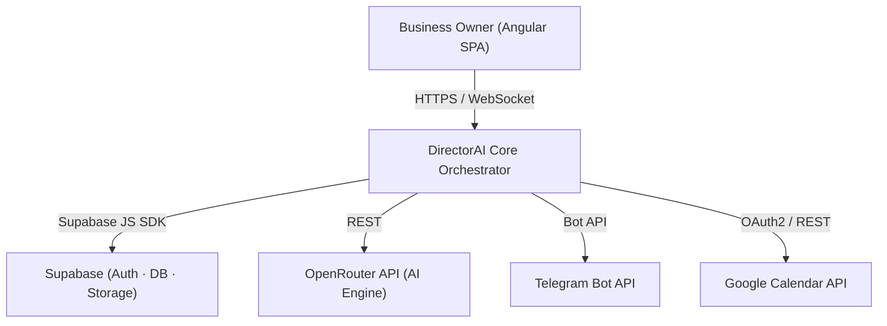
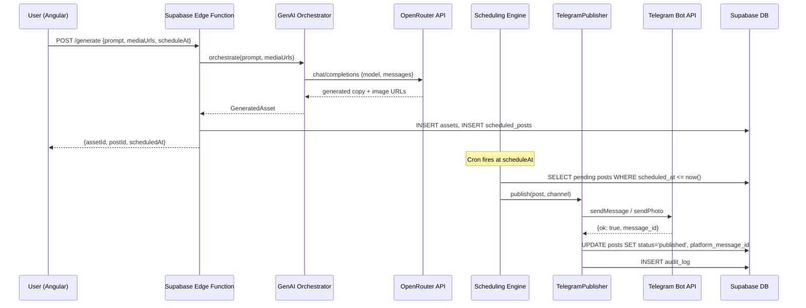

# Design Document: DirectorAI

## Overview

DirectorAI is a full-stack content automation SaaS platform that enables business owners to autonomously generate, schedule, and publish marketing content to social media channels — starting with Telegram — through an AI-powered production pipeline. The system integrates an Angular frontend with a Supabase backend, OpenRouter for AI generation, and Google Calendar for scheduling, all wired through a platform-agnostic publisher interface that ensures zero-friction expansion to future social networks.

The architecture is organized into four core modules: Infrastructure & Security (auth, storage, keys), Content Factory (AI generation, asset processing), Orchestration & Publishing (scheduling engine, editorial calendar, retry logic), and Data Intelligence (metrics ingestion, alert system). Every module exposes strict TypeScript interfaces and contracts; no module communicates with another except through those contracts, making the system safe to parallelize across teams or AI agents.

The frontend aesthetic follows an editorial control-room direction — high contrast, purposeful information density, authoritative spacing — appropriate for professionals who manage publishing operations rather than casual consumers.

---

## Architecture

### Level 0 — System Context



### Level 1 — Module Decomposition

```mermaid
graph LR
    subgraph M1["Module 1: Infrastructure & Security"]
        Auth["Auth Service"]
        Storage["Asset Storage"]
        KeyVault["Key Vault"]
        Queue["Message Queue"]
    end

    subgraph M2["Module 2: Content Factory"]
        MediaProc["Media Processor"]
        GenAI["Generative AI Orchestrator"]
        AssetEditor["Asset Editor"]
    end

    subgraph M3["Module 3: Orchestration & Publishing"]
        Scheduler["Scheduling Engine"]
        Calendar["Editorial Calendar"]
        Retry["Retry Logic Engine"]
        Publisher["SocialMediaPublisher (interface)"]
        TelegramPub["TelegramPublisher"]
    end

    subgraph M4["Module 4: Data Intelligence"]
        Metrics["Metrics Ingestion"]
        Alerts["Alert System"]
        History["Immutable Audit Log"]
    end

    M1 --> M2
    M1 --> M3
    M2 --> M3
    M3 --> M4
    TelegramPub -->|"implements"| Publisher
```



---

## Sequence Diagrams

### 1. Authenticated Content Generation & Publish Flow



### 2. Retry Logic Flow

```mermaid
sequenceDiagram
    participant SCH as Scheduling Engine
    participant PUB as SocialMediaPublisher
    participant RET as Retry Engine
    participant DB as Supabase DB
    participant ALT as Alert System

    SCH->>PUB: publish(post, channel)
    PUB-->>SCH: PublishError {code, retryable}

    alt retryable === true
        SCH->>RET: enqueue(post, attempt+1)
        RET->>DB: UPDATE posts SET status='retrying', retry_count++
        Note over RET: Exponential backoff delay
        RET->>PUB: publish(post, channel)
        PUB-->>RET: success OR final failure
    else retryable === false OR max_retries reached
        RET->>DB: UPDATE posts SET status='failed'
        RET->>ALT: notify(userId, post, error)
        ALT-->>DB: INSERT notifications
    end
```

---

## Components and Interfaces

### Component 1: Auth Service (`AuthService`)

**Purpose**: Wraps Supabase Auth to provide session management, OAuth flows, and role-based access control throughout the application.

**Interface**:
```typescript
interface AuthService {
  signUp(email: string, password: string): Promise<AuthResult>
  signIn(email: string, password: string): Promise<AuthResult>
  signInWithOAuth(provider: OAuthProvider): Promise<void>
  signOut(): Promise<void>
  resetPassword(email: string): Promise<void>
  getSession(): Promise<Session | null>
  getUser(): Promise<User | null>
  onAuthStateChange(callback: (event: AuthEvent, session: Session | null) => void): Subscription
}

type OAuthProvider = 'google'
type AuthEvent = 'SIGNED_IN' | 'SIGNED_OUT' | 'TOKEN_REFRESHED' | 'PASSWORD_RECOVERY'

interface AuthResult {
  user: User | null
  session: Session | null
  error: AuthError | null
}
```

**Responsibilities**:
- Delegate all auth operations to Supabase Auth SDK
- Expose a reactive auth state stream for the Angular app
- Enforce Row Level Security (RLS) by always passing the user's JWT to Supabase queries

---

### Component 2: Key Vault (`KeyVaultService`)

**Purpose**: Encrypts and persists user-specific API keys and tokens (Telegram bot token, etc.) in Supabase with server-side encryption, never exposing raw values to the frontend.

**Interface**:
```typescript
interface KeyVaultService {
  storeKey(userId: string, keyName: KeyName, value: string): Promise<void>
  getKey(userId: string, keyName: KeyName): Promise<string>
  rotateKey(userId: string, keyName: KeyName, newValue: string): Promise<void>
  deleteKey(userId: string, keyName: KeyName): Promise<void>
  listKeyNames(userId: string): Promise<KeyName[]>
}

type KeyName =
  | 'telegram_bot_token'
  | 'openrouter_api_key'
  | 'google_calendar_refresh_token'
```

**Responsibilities**:
- Store encrypted key material using Supabase Vault (pgcrypto)
- Never return raw key values to the Angular frontend; only server-side Edge Functions may call `getKey`
- Audit all key access operations

---

### Component 3: Asset Storage Service (`AssetStorageService`)

**Purpose**: Manages upload, retrieval, and lifecycle of all media assets (images, video, audio, PDFs, AI-generated content) using Supabase Storage.

**Interface**:
```typescript
interface AssetStorageService {
  upload(userId: string, file: File, metadata: AssetMetadata): Promise<Asset>
  getSignedUrl(assetId: string, expiresIn?: number): Promise<string>
  listAssets(userId: string, filter?: AssetFilter): Promise<Asset[]>
  deleteAsset(assetId: string): Promise<void>
  moveAsset(assetId: string, targetFolder: string): Promise<Asset>
}

interface Asset {
  id: string
  userId: string
  filename: string
  mimeType: SupportedMimeType
  sizeBytes: number
  storageUrl: string
  folder: string
  tags: string[]
  source: 'user_upload' | 'ai_generated'
  createdAt: Date
}

interface AssetMetadata {
  folder?: string
  tags?: string[]
  source: 'user_upload' | 'ai_generated'
}

interface AssetFilter {
  folder?: string
  tags?: string[]
  source?: 'user_upload' | 'ai_generated'
  mimeType?: SupportedMimeType
}

type SupportedMimeType =
  | 'image/jpeg' | 'image/png' | 'image/webp' | 'image/gif'
  | 'video/mp4' | 'video/webm'
  | 'audio/mpeg' | 'audio/wav'
  | 'application/pdf'
```

---

### Component 4: Generative AI Orchestrator (`GenAIService`)

**Purpose**: Routes AI generation requests to OpenRouter, normalizes responses, and persists generated assets.

**Interface**:
```typescript
interface GenAIService {
  generateCopy(request: CopyRequest): Promise<GeneratedCopy>
  generateImage(request: ImageRequest): Promise<GeneratedImage>
  brainstorm(request: BrainstormRequest): Promise<BrainstormResult>
  regenerate(assetId: string, instructions?: string): Promise<GeneratedAsset>
  streamGenerate(request: CopyRequest, onChunk: (chunk: string) => void): Promise<GeneratedCopy>
}

interface CopyRequest {
  userId: string
  prompt: string
  platform: SocialPlatform
  tone?: ContentTone
  referenceAssetIds?: string[]
  maxLength?: number
}

interface ImageRequest {
  userId: string
  prompt: string
  style?: string
  aspectRatio?: '1:1' | '16:9' | '9:16' | '4:3'
}

interface BrainstormRequest {
  userId: string
  topic: string
  count: number
  platform: SocialPlatform
}

interface GeneratedCopy {
  id: string
  content: string
  platform: SocialPlatform
  model: string
  tokensUsed: number
  createdAt: Date
}

interface GeneratedImage {
  id: string
  url: string
  prompt: string
  model: string
  createdAt: Date
}

type GeneratedAsset = GeneratedCopy | GeneratedImage
type SocialPlatform = 'telegram' | 'twitter' | 'instagram' | 'linkedin'
type ContentTone = 'professional' | 'casual' | 'promotional' | 'educational' | 'urgent'
```

---

### Component 5: SocialMediaPublisher Interface (Platform-Agnostic Contract)

**Purpose**: The central abstraction layer that decouples the scheduling engine from any specific social platform. Every platform integration must implement this interface — the scheduler never calls platform APIs directly.

**Interface**:
```typescript
interface SocialMediaPublisher {
  readonly platform: SocialPlatform

  publish(post: ScheduledPost, channel: ChannelConfig): Promise<PublishResult>
  delete(platformMessageId: string, channel: ChannelConfig): Promise<void>
  edit(platformMessageId: string, post: ScheduledPost, channel: ChannelConfig): Promise<PublishResult>
  getCapabilities(): PlatformCapabilities
  validatePost(post: ScheduledPost): ValidationResult
}

interface PublishResult {
  success: boolean
  platformMessageId: string
  publishedAt: Date
  platform: SocialPlatform
  error?: PublishError
}

interface PublishError {
  code: PublishErrorCode
  message: string
  retryable: boolean
  retryAfterMs?: number
}

type PublishErrorCode =
  | 'RATE_LIMITED'
  | 'INVALID_TOKEN'
  | 'CHANNEL_NOT_FOUND'
  | 'MEDIA_TOO_LARGE'
  | 'NETWORK_ERROR'
  | 'PLATFORM_OUTAGE'
  | 'CONTENT_REJECTED'

interface PlatformCapabilities {
  maxTextLength: number
  supportsImages: boolean
  supportsVideo: boolean
  supportsAudio: boolean
  supportsPDFs: boolean
  supportsCarousel: boolean
  supportsScheduledEdit: boolean
}

interface ChannelConfig {
  platform: SocialPlatform
  channelId: string
  credentials: Record<string, string>  // resolved from KeyVault at runtime
}

interface ValidationResult {
  valid: boolean
  errors: string[]
  warnings: string[]
}
```

---

### Component 6: TelegramPublisher

**Purpose**: Implements `SocialMediaPublisher` for the Telegram Bot API. The only platform-specific code that knows about Telegram.

**Interface**:
```typescript
class TelegramPublisher implements SocialMediaPublisher {
  readonly platform: SocialPlatform = 'telegram'

  publish(post: ScheduledPost, channel: ChannelConfig): Promise<PublishResult>
  delete(platformMessageId: string, channel: ChannelConfig): Promise<void>
  edit(platformMessageId: string, post: ScheduledPost, channel: ChannelConfig): Promise<PublishResult>
  getCapabilities(): PlatformCapabilities
  validatePost(post: ScheduledPost): ValidationResult

  // Internal — not exposed via interface
  private buildPayload(post: ScheduledPost): TelegramSendPayload
  private mapApiError(error: TelegramApiError): PublishError
}
```

---

### Component 7: Scheduling Engine (`SchedulingEngine`)

**Purpose**: Polls for pending scheduled posts and dispatches them through the appropriate `SocialMediaPublisher`. Runs as a Supabase Edge Function on a cron schedule.

**Interface**:
```typescript
interface SchedulingEngine {
  tick(): Promise<DispatchSummary>
  schedulePost(post: CreatePostRequest): Promise<ScheduledPost>
  cancelPost(postId: string): Promise<void>
  reschedulePost(postId: string, newScheduledAt: Date): Promise<ScheduledPost>
  getUpcomingPosts(userId: string, from: Date, to: Date): Promise<ScheduledPost[]>
}

interface ScheduledPost {
  id: string
  userId: string
  platform: SocialPlatform
  channelId: string
  content: PostContent
  scheduledAt: Date
  status: PostStatus
  retryCount: number
  maxRetries: number
  platformMessageId?: string
  publishedAt?: Date
  recurrenceRule?: RecurrenceRule
  createdAt: Date
  updatedAt: Date
}

interface PostContent {
  text?: string
  mediaAssetIds?: string[]
  mediaType?: 'photo' | 'video' | 'audio' | 'document'
  caption?: string
}

type PostStatus = 'draft' | 'scheduled' | 'publishing' | 'published' | 'retrying' | 'failed' | 'cancelled'

interface RecurrenceRule {
  frequency: 'daily' | 'weekly' | 'monthly'
  interval: number
  daysOfWeek?: number[]
  endDate?: Date
  maxOccurrences?: number
}

interface DispatchSummary {
  processed: number
  succeeded: number
  failed: number
  retryQueued: number
}
```

---

### Component 8: Retry Logic Engine (`RetryEngine`)

**Purpose**: Manages exponential-backoff retry queues for failed publish attempts, ensuring no content is silently lost.

**Interface**:
```typescript
interface RetryEngine {
  enqueue(post: ScheduledPost, error: PublishError): Promise<void>
  processQueue(): Promise<void>
  getRetryStatus(postId: string): Promise<RetryStatus>
  cancelRetry(postId: string): Promise<void>
  getRetryHistory(userId: string, limit?: number): Promise<RetryRecord[]>
}

interface RetryStatus {
  postId: string
  attempt: number
  maxAttempts: number
  nextRetryAt: Date | null
  lastError: PublishError
  status: 'queued' | 'exhausted' | 'cancelled'
}

interface RetryRecord {
  postId: string
  attempt: number
  attemptedAt: Date
  error: PublishError
  outcome: 'success' | 'failed'
}
```

---

### Component 9: Metrics Service (`MetricsService`)

**Purpose**: Ingests and stores Telegram engagement metrics (views, reactions, shares), computes aggregates, and exposes them for dashboard visualization.

**Interface**:
```typescript
interface MetricsService {
  ingestMetrics(platformMessageId: string, metrics: RawPlatformMetrics): Promise<void>
  getPostMetrics(postId: string): Promise<PostMetrics>
  getChannelSummary(channelId: string, dateRange: DateRange): Promise<ChannelSummary>
  getDashboardMetrics(userId: string): Promise<DashboardMetrics>
  getEngagementTrend(channelId: string, granularity: 'day' | 'week' | 'month'): Promise<TrendPoint[]>
}

interface PostMetrics {
  postId: string
  platformMessageId: string
  views: number
  reactions: Record<string, number>
  forwards: number
  replies: number
  measuredAt: Date
}

interface ChannelSummary {
  channelId: string
  platform: SocialPlatform
  totalPosts: number
  totalViews: number
  avgEngagementRate: number
  topPost: PostMetrics
  dateRange: DateRange
}

interface DashboardMetrics {
  totalPostsPublished: number
  postsThisWeek: number
  avgViewsPerPost: number
  failureRate: number
  upcomingPostsCount: number
  recentActivity: ActivityEvent[]
}

interface DateRange {
  from: Date
  to: Date
}

interface TrendPoint {
  date: Date
  value: number
  label: string
}
```

---

### Component 10: Alert Service (`AlertService`)

**Purpose**: Delivers in-app and push notifications to users about publish success and failures.

**Interface**:
```typescript
interface AlertService {
  notify(userId: string, event: AlertEvent): Promise<void>
  getNotifications(userId: string, unreadOnly?: boolean): Promise<Notification[]>
  markAsRead(notificationId: string): Promise<void>
  markAllAsRead(userId: string): Promise<void>
  subscribeToRealtime(userId: string, callback: (n: Notification) => void): Unsubscribe
}

interface AlertEvent {
  type: AlertType
  severity: 'info' | 'warning' | 'error' | 'success'
  title: string
  message: string
  metadata?: Record<string, unknown>
}

type AlertType =
  | 'post_published'
  | 'post_failed'
  | 'post_retrying'
  | 'retry_exhausted'
  | 'api_key_invalid'

type Unsubscribe = () => void
```

---

## Data Models

### Database Schema Overview

All tables implement Row Level Security (RLS). Every `user_id` column is a foreign key to `auth.users`.

### Model 1: `users_profile`

```typescript
interface UserProfile {
  id: string               // UUID, FK auth.users.id
  email: string
  displayName: string
  avatarUrl?: string
  timezone: string         // IANA tz, e.g. 'America/New_York'
  planId: PlanId
  onboardingCompleted: boolean
  createdAt: Date
  updatedAt: Date
}
```

**Validation Rules**:
- `timezone` must be a valid IANA timezone string
- `email` immutable after creation (managed by Supabase Auth)

---

### Model 2: `channels`

```typescript
interface Channel {
  id: string
  userId: string
  platform: SocialPlatform
  name: string
  channelIdentifier: string   // e.g. Telegram @channelusername or numeric ID
  isActive: boolean
  createdAt: Date
}
```

**Validation Rules**:
- One channel per `(userId, platform, channelIdentifier)` combination
- `channelIdentifier` validated per platform format rules

---

### Model 3: `scheduled_posts`

```typescript
interface ScheduledPostRecord {
  id: string
  userId: string
  channelId: string
  textContent?: string
  mediaAssetIds: string[]          // FK → assets.id[]
  mediaType?: 'photo' | 'video' | 'audio' | 'document'
  scheduledAt: Date
  status: PostStatus
  retryCount: number
  maxRetries: number
  platformMessageId?: string
  publishedAt?: Date
  recurrenceRuleId?: string        // FK → recurrence_rules.id
  parentPostId?: string            // FK → scheduled_posts.id (for recurrence instances)
  createdAt: Date
  updatedAt: Date
}
```

**Validation Rules**:
- `scheduledAt` must be in the future at creation time
- `textContent` length validated against platform capabilities
- `status` transitions: draft→scheduled→publishing→published|failed; failed→retrying→published|failed

---

### Model 4: `assets`

```typescript
interface AssetRecord {
  id: string
  userId: string
  filename: string
  mimeType: SupportedMimeType
  sizeBytes: number
  storagePath: string              // Supabase Storage path
  folder: string
  tags: string[]
  source: 'user_upload' | 'ai_generated'
  generationPrompt?: string        // populated for ai_generated
  aiModel?: string
  createdAt: Date
}
```

---

### Model 5: `audit_log`

```typescript
interface AuditLogRecord {
  id: string
  userId: string
  postId: string
  action: 'published' | 'failed' | 'retried' | 'cancelled' | 'edited' | 'deleted'
  platform: SocialPlatform
  platformMessageId?: string
  errorCode?: PublishErrorCode
  metadata: Record<string, unknown>
  occurredAt: Date
}
```

**Validation Rules**:
- Immutable after insertion (no UPDATE, no DELETE via RLS)
- `occurredAt` set server-side; clients cannot override

---

## Algorithmic Pseudocode

### Algorithm 1: Scheduling Engine `tick()`

```pascal
ALGORITHM tick()
INPUT: none (reads from DB)
OUTPUT: DispatchSummary

PRECONDITIONS:
  - Publisher registry contains at least one SocialMediaPublisher
  - DB connection is available
  - System time is accurate (NTP-synced)

POSTCONDITIONS:
  - All posts with scheduledAt <= now() AND status='scheduled' have been dispatched
  - Each dispatched post has status updated to 'published' OR 'retrying' OR 'failed'
  - DispatchSummary reflects exact counts of each outcome

BEGIN
  now ← currentTimestamp()
  posts ← db.query(
    SELECT * FROM scheduled_posts
    WHERE status = 'scheduled'
      AND scheduled_at <= now
    ORDER BY scheduled_at ASC
    LIMIT MAX_BATCH_SIZE
    FOR UPDATE SKIP LOCKED         -- concurrent-safe row locking
  )

  summary ← { processed: 0, succeeded: 0, failed: 0, retryQueued: 0 }

  FOR EACH post IN posts DO
    -- LOOP INVARIANT: all posts processed before this iteration
    --   have been updated to a terminal or retrying state
    summary.processed ← summary.processed + 1

    db.update(post.id, { status: 'publishing' })

    publisher ← publisherRegistry.get(post.platform)
    channel   ← channelService.get(post.channelId)
    validation ← publisher.validatePost(post)

    IF NOT validation.valid THEN
      db.update(post.id, { status: 'failed' })
      auditLog.insert(post, 'failed', { reason: validation.errors })
      alertService.notify(post.userId, buildFailureAlert(post, validation.errors))
      summary.failed ← summary.failed + 1
      CONTINUE
    END IF

    result ← publisher.publish(post, channel)

    IF result.success THEN
      db.update(post.id, {
        status: 'published',
        platform_message_id: result.platformMessageId,
        published_at: result.publishedAt
      })
      auditLog.insert(post, 'published', result)
      alertService.notify(post.userId, buildSuccessAlert(post))
      summary.succeeded ← summary.succeeded + 1

      IF post.recurrenceRuleId IS NOT NULL THEN
        nextPost ← recurrenceService.scheduleNext(post)
        db.insert(nextPost)
      END IF

    ELSE
      IF result.error.retryable AND post.retryCount < post.maxRetries THEN
        retryEngine.enqueue(post, result.error)
        summary.retryQueued ← summary.retryQueued + 1
      ELSE
        db.update(post.id, { status: 'failed' })
        auditLog.insert(post, 'failed', result.error)
        alertService.notify(post.userId, buildFailureAlert(post, result.error))
        summary.failed ← summary.failed + 1
      END IF
    END IF
  END FOR

  ASSERT summary.processed = summary.succeeded + summary.failed + summary.retryQueued

  RETURN summary
END
```

### Algorithm 2: Retry Engine `processQueue()` with Exponential Backoff

```pascal
ALGORITHM processQueue()
INPUT: none (reads retry queue from DB)
OUTPUT: void

PRECONDITIONS:
  - Posts in 'retrying' status have retry_count < max_retries
  - next_retry_at is set for each queued post

POSTCONDITIONS:
  - All posts with next_retry_at <= now() have been re-dispatched
  - retry_count incremented for each attempt
  - Posts exceeding max_retries are moved to 'failed'

CONSTANT BASE_DELAY_MS   ← 1000   -- 1 second
CONSTANT MAX_DELAY_MS    ← 300000 -- 5 minutes

BEGIN
  now     ← currentTimestamp()
  pending ← db.query(
    SELECT * FROM scheduled_posts
    WHERE status = 'retrying'
      AND next_retry_at <= now
    FOR UPDATE SKIP LOCKED
  )

  FOR EACH post IN pending DO
    -- LOOP INVARIANT: post.retry_count < post.max_retries at loop entry
    publisher ← publisherRegistry.get(post.platform)
    channel   ← channelService.get(post.channelId)
    result    ← publisher.publish(post, channel)

    IF result.success THEN
      db.update(post.id, {
        status: 'published',
        platform_message_id: result.platformMessageId,
        published_at: result.publishedAt
      })
      auditLog.insert(post, 'published', { via: 'retry', attempt: post.retryCount })
      alertService.notify(post.userId, buildRetrySuccessAlert(post))

    ELSE
      newRetryCount ← post.retryCount + 1

      IF result.error.retryable AND newRetryCount < post.maxRetries THEN
        -- Exponential backoff with jitter
        delay    ← MIN(BASE_DELAY_MS * (2 ^ newRetryCount), MAX_DELAY_MS)
        jitter   ← RANDOM(0, delay * 0.1)
        nextRetry ← now + delay + jitter

        db.update(post.id, {
          status: 'retrying',
          retry_count: newRetryCount,
          next_retry_at: nextRetry
        })
        auditLog.insert(post, 'retried', { attempt: newRetryCount, nextRetry })

      ELSE
        -- Exhausted retries or non-retryable error
        db.update(post.id, { status: 'failed', retry_count: newRetryCount })
        auditLog.insert(post, 'failed', { exhausted: true, lastError: result.error })
        alertService.notify(post.userId, buildRetryExhaustedAlert(post, result.error))
      END IF
    END IF
  END FOR
END
```

### Algorithm 3: AI Generation Orchestration

```pascal
ALGORITHM orchestrateGeneration(request: CopyRequest)
INPUT: request containing userId, prompt, platform, tone, referenceAssetIds
OUTPUT: GeneratedCopy

PRECONDITIONS:
  - request.prompt is non-empty and <= 2000 characters
  - OPENROUTER_API_KEY is valid and available in KeyVault

POSTCONDITIONS:
  - GeneratedCopy is persisted as an Asset with source='ai_generated'
  - If error: descriptive PublishError returned

BEGIN
  -- Build context
  systemPrompt  ← promptBuilder.buildSystemPrompt(request.platform, request.tone)
  userMessage   ← promptBuilder.buildUserMessage(request.prompt, request.referenceAssetIds)
  model         ← modelSelector.selectModel('copy', request.platform)

  -- Call OpenRouter
  response ← openRouterClient.chatCompletions({
    model: model,
    messages: [
      { role: 'system', content: systemPrompt },
      { role: 'user',   content: userMessage }
    ],
    max_tokens: request.maxLength ?? platformLimits[request.platform],
    temperature: 0.7
  })

  IF response.error IS NOT NULL THEN
    THROW AIProviderError(response.error.message)
  END IF

  generatedText ← response.choices[0].message.content

  -- Persist
  asset ← assetStorage.upload(request.userId, {
    content: generatedText,
    mimeType: 'text/plain',
    metadata: { source: 'ai_generated', prompt: request.prompt, model }
  })

  -- Update usage
  db.increment(request.userId, 'ai_generations_this_month', 1)

  RETURN {
    id: asset.id,
    content: generatedText,
    platform: request.platform,
    model: model,
    tokensUsed: response.usage.total_tokens,
    createdAt: now()
  }
END
```

---

## Key Functions with Formal Specifications

### `TelegramPublisher.publish()`

```typescript
async publish(post: ScheduledPost, channel: ChannelConfig): Promise<PublishResult>
```

**Preconditions:**
- `post.status === 'publishing'`
- `channel.credentials['telegram_bot_token']` is non-empty and valid
- `post.content.text` length ≤ 4096 characters (Telegram caption/message limit)
- If `post.content.mediaAssetIds` is non-empty, all assets exist in storage and are accessible

**Postconditions:**
- On success: returns `PublishResult` where `success === true` and `platformMessageId` is a non-empty string from Telegram
- On failure: returns `PublishResult` where `success === false` and `error.retryable` correctly reflects whether the Telegram error code is transient
- Does not mutate `post` or `channel` (immutable inputs)
- Makes exactly one Telegram API call per invocation (no silent retries inside this method — retry responsibility belongs to `RetryEngine`)

**Loop Invariants:** N/A (no iteration)

---

### `SchedulingEngine.schedulePost()`

```typescript
async schedulePost(request: CreatePostRequest): Promise<ScheduledPost>
```

**Preconditions:**
- `request.scheduledAt > now()`
- `request.userId` has access to `Feature.scheduled_posts`
- `request.channelId` belongs to `request.userId`
- `request.content.text` or `request.content.mediaAssetIds` is non-empty (cannot schedule empty post)
- If `request.recurrenceRule` is set, `request.recurrenceRule.endDate > request.scheduledAt` (if endDate is provided)

**Postconditions:**
- Returns a `ScheduledPost` with `status === 'scheduled'`
- Post is persisted to DB; calling `getUpcomingPosts` will include it
- If `recurrenceRule` is provided, a `recurrence_rules` record is created and linked
- Emits no network calls to Telegram (scheduling is a DB operation only)

---

### `MetricsService.getEngagementTrend()`

```typescript
async getEngagementTrend(channelId: string, granularity: 'day' | 'week' | 'month'): Promise<TrendPoint[]>
```

**Preconditions:**
- `channelId` is non-empty and belongs to an authenticated user
- `granularity` is one of the allowed enum values

**Postconditions:**
- Returns array of `TrendPoint` sorted by `date` ascending
- Each `TrendPoint.value` ≥ 0
- Array length corresponds to the last 30 days / 12 weeks / 12 months depending on granularity
- Empty periods are included with `value = 0` (no gaps)

---

## Example Usage

### Scheduling a Post from the Angular Frontend

```typescript
// In Angular PostEditorComponent
import { SchedulingService } from '@/core/services/scheduling.service'
import { GenAIService } from '@/core/services/gen-ai.service'

@Component({ /* ... */ })
export class PostEditorComponent {
  constructor(
    private scheduling: SchedulingService,
    private genAI: GenAIService,
  ) {}

  async generateAndSchedule(): Promise<void> {
    // 1. Generate copy via AI
    const copy = await this.genAI.generateCopy({
      userId: this.currentUser.id,
      prompt: 'Announce our new product launch — focus on exclusivity',
      platform: 'telegram',
      tone: 'promotional',
    })

    // 2. Schedule the generated post
    const post = await this.scheduling.schedulePost({
      userId: this.currentUser.id,
      channelId: this.selectedChannel.id,
      content: {
        text: copy.content,
        mediaAssetIds: this.selectedAssetIds,
        mediaType: 'photo',
      },
      scheduledAt: this.selectedDateTime,
    })

    this.router.navigate(['/calendar'], {
      queryParams: { highlight: post.id }
    })
  }
}
```

### Implementing a New Platform Publisher

```typescript
// Adding a new platform requires only implementing SocialMediaPublisher
export class InstagramPublisher implements SocialMediaPublisher {
  readonly platform: SocialPlatform = 'instagram'

  async publish(post: ScheduledPost, channel: ChannelConfig): Promise<PublishResult> {
    const token = channel.credentials['instagram_access_token']
    const payload = this.buildPayload(post)

    try {
      const response = await this.igClient.publishMedia(token, payload)
      return {
        success: true,
        platformMessageId: response.id,
        publishedAt: new Date(),
        platform: 'instagram',
      }
    } catch (err) {
      return {
        success: false,
        platformMessageId: '',
        publishedAt: new Date(),
        platform: 'instagram',
        error: this.mapApiError(err),
      }
    }
  }

  getCapabilities(): PlatformCapabilities {
    return {
      maxTextLength: 2200,
      supportsImages: true,
      supportsVideo: true,
      supportsAudio: false,
      supportsPDFs: false,
      supportsCarousel: true,
      supportsScheduledEdit: false,
    }
  }

  // ...other required methods
}

// Register in publisher registry — no changes to SchedulingEngine required
publisherRegistry.register('instagram', new InstagramPublisher(igClient))
```

---

## Correctness Properties

These properties must hold universally across all executions. They are the basis for property-based and integration tests.

### Property 1: Publishing Idempotency
For any post `p`, calling `publisher.publish(p, channel)` when `p.status === 'published'` must return an error with `code === 'CONTENT_REJECTED'` and never create a duplicate message on the platform.

### Property 2: Retry Count Monotonicity
For any post `p` moving through retry cycles:
`∀ t1 < t2: p.retryCount(t1) ≤ p.retryCount(t2)` — the retry count never decreases.

### Property 3: Max Retries Bound
For any post `p`:
`p.retryCount ≤ p.maxRetries` — the retry engine never dispatches more attempts than the configured maximum.

### Property 4: Status Terminal Integrity
Once a post reaches status `'published'` or `'failed'`, no operation may change its status to any other value. The only allowed mutation is inserting audit log entries.

### Property 5: Audit Log Immutability
`∀ record ∈ audit_log: ¬∃ operation that updates or deletes the record`. Enforced via RLS policy: no UPDATE or DELETE on `audit_log` table for any role including service_role, only INSERT is permitted.

### Property 6: Platform-Agnostic Scheduler
The `SchedulingEngine.tick()` algorithm must not contain any reference to `'telegram'` or any other specific platform identifier. All platform-specific behavior flows through `SocialMediaPublisher` implementations.

### Property 8: Scheduled Time Invariant
`∀ post p created via schedulePost(): p.scheduledAt > p.createdAt`. Posts cannot be scheduled in the past.

### Property 9: Asset Ownership Isolation
`∀ asset a, user u: assetStorage.listAssets(u) never returns assets where a.userId ≠ u.id`. Enforced by both application logic and Supabase RLS.

### Property 10: Backoff Strictly Increasing
For a post with consecutive retry attempts at times `t1, t2, t3...`:
`t2 - t1 ≤ t3 - t2 ≤ t4 - t3 ...` — each subsequent retry delay is no shorter than the previous (modulo jitter, within 10% variance).

---

## Error Handling

### Scenario 1: Telegram API Unavailable (5xx / Network Timeout)

**Condition**: `TelegramPublisher.publish()` receives a network error or 5xx response  
**Response**: Returns `PublishResult` with `error.code = 'NETWORK_ERROR'` and `error.retryable = true`  
**Recovery**: `RetryEngine` queues the post with exponential backoff; user receives an in-app `post_retrying` alert with estimated retry time. If all retries are exhausted, `retry_exhausted` alert fires with manual re-publish option.

### Scenario 2: Invalid Telegram Bot Token

**Condition**: Telegram returns 401 Unauthorized  
**Response**: Returns `PublishResult` with `error.code = 'INVALID_TOKEN'` and `error.retryable = false`  
**Recovery**: Post moved to `failed` immediately (retrying with the same bad token is pointless). Alert fires with deep-link to Settings → API Keys to prompt the user to update their bot token.

### Scenario 5: Asset Upload Exceeds Size Limit

**Condition**: Uploaded file exceeds platform capability or Supabase Storage limit  
**Response**: `AssetStorageService.upload()` rejects with `AssetTooLargeError` containing `maxBytes` and `actualBytes`  
**Recovery**: Frontend displays inline error with exact limit, suggests compression options for images/video.

### Scenario 6: Scheduling Engine Cron Failure

**Condition**: Supabase Edge Function executing `tick()` crashes mid-batch  
**Response**: Posts locked with `FOR UPDATE` are released when the transaction rolls back. Posts remain in `scheduled` or `publishing` status.  
**Recovery**: Next cron invocation picks up posts that are still `scheduled`. Posts stuck in `publishing` for more than 5 minutes are reset to `scheduled` by a cleanup query run at cron start.

---

## Testing Strategy

### Unit Testing Approach

Unit tests cover pure validation, mapping, formatting, status-transition, and property logic only. Any behavior that depends on Supabase, OpenRouter, Telegram, or Google Calendar is verified through direct calls to official provider endpoints using staging or test-mode credentials. The Angular frontend uses Jest + Angular Testing Library for component logic; backend Edge Functions use Deno test runner or Vitest for pure code paths.

Key unit test targets:
- `TelegramPublisher`: verify payload construction, capability limits, duplicate-publish guard, and error mapping helpers; live publish/error behavior is covered by Telegram integration tests
- `RetryEngine`: verify backoff delay calculations, max retry enforcement, and correct status transitions
- `SchedulingEngine.tick()`: verify pure dispatch summary math, status transition rules, and recurrence scheduling helpers; DB locking is covered against Supabase staging
- `GenAIService.generateCopy()`: verify prompt construction and response normalization helpers; successful generation is covered against OpenRouter directly

### Property-Based Testing Approach

**Property Test Library**: `fast-check` (TypeScript/JavaScript)

Properties to test:
- **P3 (Max Retries Bound)**: for arbitrary `maxRetries` values (1–10) and any sequence of failures, `retryCount` never exceeds `maxRetries`
- **P8 (Scheduled Time Invariant)**: for any `schedulePost()` call, `scheduledAt` is always after `createdAt`
- **P10 (Backoff Strictly Increasing)**: for arbitrary retry sequences, delay at attempt `n+1` ≥ delay at attempt `n`
- **P2 (Retry Count Monotonicity)**: for any sequence of retry operations on a post, retry count is non-decreasing

```typescript
import * as fc from 'fast-check'

// Example: P3 property test
test('retry count never exceeds maxRetries', () => {
  fc.assert(
    fc.property(
      fc.integer({ min: 1, max: 10 }),  // maxRetries
      fc.array(fc.boolean(), { maxLength: 20 }),  // sequence of failures
      (maxRetries, failures) => {
        const engine = new RetryEngine({ maxRetries })
        failures.forEach(failed => engine.recordAttemptResult(failed))
        return engine.retryCount <= maxRetries
      }
    )
  )
})
```

### Integration Testing Approach

Integration tests run only against official external services or provider-supported test environments: a hosted Supabase staging project, OpenRouter with test credentials, a real Telegram bot and private test channel, and a Google Calendar test account/calendar. No local database, in-memory database, mocked API server, MSW handler, or simulated provider response is allowed for integration coverage.

Key integration test scenarios:
1. Full publish flow: create post → tick() → verify the real Telegram test channel received the message → verify Supabase staging status = 'published'
2. Retry flow: use real provider error conditions where available, such as revoked/invalid Telegram test credentials for non-retryable paths and provider/test-network failures for retryable paths; verify retry state in Supabase staging
3. RLS enforcement: user A cannot read user B's assets, posts, or channels
4. Audit log immutability: attempt to UPDATE or DELETE audit_log row → verify RLS rejects it
5. Recurrence: publish recurrent post → verify next instance scheduled with correct `scheduledAt`

---

## Performance Considerations

### Scheduling Engine
- `tick()` runs on a 1-minute cron via Supabase Edge Functions
- Batch size capped at 100 posts per tick to stay within Edge Function execution limits
- `FOR UPDATE SKIP LOCKED` prevents concurrent cron executions from processing the same post
- Posts stuck in `publishing` state for > 5 minutes are reset at tick start (guards against crashed invocations)

### AI Generation
- OpenRouter calls are async and non-blocking; Angular frontend uses streaming (`streamGenerate`) for long copy to display tokens progressively
- Generated assets cached in Supabase Storage; re-requests for the same prompt within a 24-hour window can return cached results (optional optimization)

### Metrics Ingestion
- Telegram does not push metrics; a secondary cron polls `getUpdates` or uses webhook forwarding every 15 minutes for recent posts
- Aggregated metrics stored in materialized views (`channel_daily_metrics`) refreshed every hour to keep dashboard queries fast

### Asset Storage
- Images served via Supabase Storage CDN with signed URLs expiring in 1 hour for private assets
- File size limits enforced at upload: images ≤ 20MB, video ≤ 200MB, audio ≤ 50MB, PDF ≤ 50MB

### Frontend
- Angular lazy-loaded route modules: each view loads only its own bundle
- Editorial Calendar uses virtual scrolling for large post lists
- Real-time notifications via Supabase Realtime (WebSocket) — no polling

---

## Security Considerations

### API Key Management
- Telegram bot tokens and other user-supplied keys are stored encrypted in Supabase Vault (pgcrypto AES-256)
- Raw key values never traverse the Angular frontend — only server-side Edge Functions call `KeyVaultService.getKey()`
- All environment variables (`SUPABASE_SERVICE_ROLE_KEY`, `OPENROUTER_API_KEY`, etc.) are set in Supabase project secrets, not in code

### Row Level Security (RLS)
- Every table in the schema has RLS enabled. Default policy: deny all. Explicit policies grant access only to rows where `user_id = auth.uid()`
- `audit_log` table: INSERT allowed for service_role only; SELECT allowed for owning user; UPDATE and DELETE denied for all roles

### Content Isolation
- Multi-tenant: every resource (assets, posts, channels) is scoped to a `user_id`. Cross-user access is impossible at the DB layer even if application logic has a bug

### Authentication
- Supabase Auth with JWT; tokens expire in 1 hour with automatic refresh
- Password reset flow uses time-limited OTP links (Supabase default: 24 hours)
- All API routes behind Supabase's built-in auth middleware; unauthenticated requests return 401

---

## Dependencies

### Backend
| Dependency | Version | Purpose |
|---|---|---|
| `@supabase/supabase-js` | `^2.x` | DB, Auth, Storage, Realtime client |
| `openai` | `^4.x` | OpenRouter API (OpenAI-compatible SDK) |
| `googleapis` | `^140.x` | Google Calendar OAuth2 + API |
| `node-telegram-bot-api` (or raw fetch) | `^0.64.x` | Telegram Bot API calls |

### Frontend
| Dependency | Version | Purpose |
|---|---|---|
| `@angular/core` | `^17.x` | SPA framework |
| `@supabase/supabase-js` | `^2.x` | Auth + realtime on frontend |
| `fullcalendar` / `@fullcalendar/angular` | `^6.x` | Editorial Calendar view |
| `chart.js` / `ng2-charts` | `^4.x` | Metrics charts |
| `@angular/cdk` | `^17.x` | Drag-and-drop for calendar, virtual scroll |

### Development & Testing
| Dependency | Version | Purpose |
|---|---|---|
| `fast-check` | `^3.x` | Property-based testing |
| `vitest` | `^1.x` | Unit test runner (Edge Functions) |
| `@testing-library/angular` | `^17.x` | Angular component testing |
| `supabase` CLI | `^1.x` | Remote migrations and Edge Functions dev |

---

## UI/UX Design Direction

### Design Tokens

**Color Palette** (editorial control-room aesthetic):
- `--color-ink`: `#0D0F12` — near-black, primary text and backgrounds
- `--color-paper`: `#F5F4F0` — off-white, light-mode surface (warm but not cream)
- `--color-signal`: `#E8C24A` — muted amber, the one warm accent (status indicators, CTA highlights)
- `--color-live`: `#3EC88A` — teal-green, success/published state
- `--color-fault`: `#D94F3D` — brick red, error/failed state
- `--color-steel`: `#2A2D35` — dark card surface, sidebar background

**Typography**:
- Display: `Druk Wide` or `Aktiv Grotesk Condensed` — tight, authoritative, uppercase sparingly; used only for primary headings and metric callouts
- Body: `Inter` — neutral, high-legibility at dense information sizes
- Utility/Data: `JetBrains Mono` — monospace for message IDs, log entries, API keys, timestamps

**Layout Principle**: Deliberate whitespace between sections using an 8px grid; generous margins (not cramped), but content-dense within each card. No decorative gradients. Borders carry information (active/inactive states, platform color coding).

**Motion**: Page transitions use a subtle horizontal slide with 150ms ease-out (production control-room feel, not playful). Data charts animate in on mount (300ms stagger).

---

## Application Views

### View 1: Authentication (`/auth`)
Sub-routes: `/auth/login`, `/auth/register`, `/auth/recover`
- Clean, minimal — ink background, centered card
- Logo mark at top; no sidebar
- Form fields with high-contrast labels, visible focus rings
- Error messages below each field (active voice: "Enter a valid email address")

### View 2: Global Dashboard (`/dashboard`)
- KPI row: Posts Published (this week), Avg Views/Post, Active Channels, Failure Rate
- Recent Activity feed (last 10 events from `audit_log`)
- Mini Editorial Calendar (3-day lookahead)
- System health indicators (scheduler last ran, API statuses)

### View 3: AI Studio (`/studio`)
- Split-pane: left = prompt input + settings (platform, tone, length); right = generated output
- Streaming output renders token-by-token for copy generation
- "Save to Assets" and "Schedule Now" CTAs below generated output
- Brainstorm mode: generates 5 post ideas as cards; each expandable to full copy
- Image generation tab with aspect ratio selector
- Usage meter (AI generations remaining this month) in top-right corner

### View 4: Asset Repository (`/assets`)
- File manager layout: left sidebar = folders/tags filter; right = grid or list view toggle
- Cards show thumbnail, filename, source badge (AI/Upload), creation date
- Drag-and-drop upload zone
- Multi-select with bulk actions (delete, move, tag)
- Preview modal with signed URL download option

### View 5: Editorial Calendar (`/calendar`)
- FullCalendar monthly/weekly view; posts appear as colored blocks by platform
- Drag-and-drop to reschedule (calls `reschedulePost()`)
- Click post → side drawer with status, content preview, actions (Edit, Cancel, View Metrics)
- "New Post" button opens inline creation form
- Pending/scheduled/published/failed shown with distinct styles using design token colors

### View 6: Platform Metrics (`/metrics`)
- Platform tabs (currently: Telegram only)
- Per-channel selector dropdown
- Charts: Views Trend (line), Engagement Rate (bar), Top Posts (table sorted by views)
- Date range picker (last 7d / 30d / 90d / custom)
- Export to CSV button

### View 7: Automation Hub (`/automation`)
- Recurrence rules manager: list of active rules, enable/disable toggles, edit frequency
- Retry rules configuration: per-channel max retries, backoff settings
- Activity Log: paginated table of all `audit_log` entries with filters by status, date, platform
- Failed Posts panel: quick re-publish action inline

### View 8: Settings (`/settings`)
Sub-sections: Profile, API Keys, Channels
- Profile: display name, timezone, avatar
- API Keys: masked fields for Telegram bot token, Google Calendar; "Update" triggers `KeyVaultService.rotateKey()`
- Channels: list of connected channels, add/remove

---

## Directory Structure

```
DirectorAI/
├── .env                              # Environment variables (never committed)
├── .ai/
│   └── frontend_guidelines.md
├── .kiro/
│   └── specs/
│       └── director-ai/
│           ├── .config.kiro
│           ├── design.md
│           ├── requirements.md       # To be generated next
│           └── tasks.md              # To be generated next
├── supabase/
│   ├── config.toml
│   ├── migrations/
│   │   ├── 001_initial_schema.sql
│   │   ├── 002_rls_policies.sql
│   │   └── 003_audit_log.sql
│   └── functions/
│       ├── scheduling-tick/          # Cron: dispatch scheduled posts
│       │   └── index.ts
│       ├── retry-processor/          # Cron: process retry queue
│       │   └── index.ts
│       ├── generate-content/         # POST: AI generation
│       │   └── index.ts
│       └── metrics-sync/             # Cron: fetch Telegram metrics
│           └── index.ts
├── src/                              # Angular SPA
│   ├── app/
│   │   ├── core/
│   │   │   ├── services/
│   │   │   │   ├── auth.service.ts
│   │   │   │   ├── asset-storage.service.ts
│   │   │   │   ├── gen-ai.service.ts
│   │   │   │   ├── scheduling.service.ts
│   │   │   │   ├── metrics.service.ts
│   │   │   │   └── alert.service.ts
│   │   │   ├── guards/
│   │   │   │   └── auth.guard.ts
│   │   │   └── interceptors/
│   │   │       └── auth.interceptor.ts
│   │   ├── shared/
│   │   │   ├── components/
│   │   │   │   └── status-badge/
│   │   │   └── design-tokens/
│   │   │       └── tokens.scss
│   │   └── features/
│   │       ├── auth/
│   │       ├── dashboard/
│   │       ├── studio/
│   │       ├── assets/
│   │       ├── calendar/
│   │       ├── metrics/
│   │       ├── automation/
│   │       └── settings/
│   ├── environments/
│   │   ├── environment.ts
│   │   └── environment.prod.ts
│   └── styles/
│       ├── _tokens.scss
│       ├── _typography.scss
│       └── global.scss
└── docs/
    └── onboarding.md                 # To be generated as task
```
